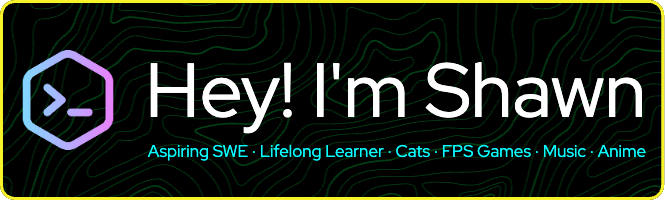

  

  
 <!--  -->
 
 

  
  
  

## 💻 Stack

## 🚀 Projects

  
  

## 🎵 Currently Listening To

## 🌐 Connect With Me

I'm always open to interesting conversations and collaboration opportunities. Feel free to reach out!

---